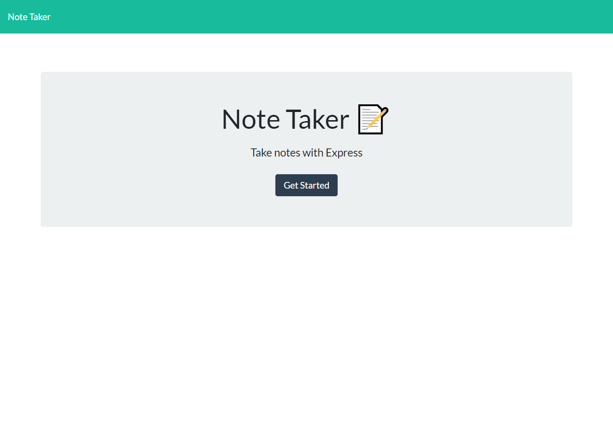
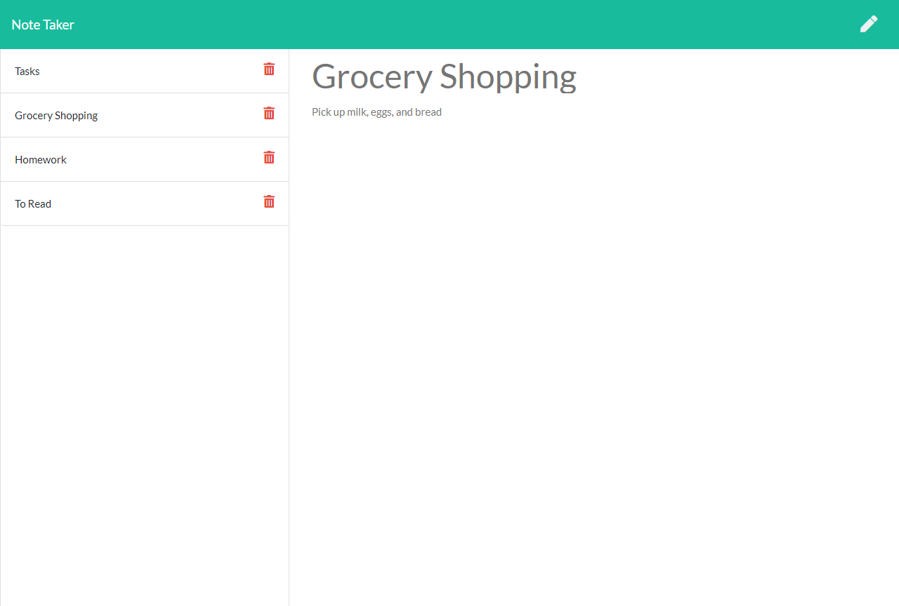

# 🗒 Note Taker
[CLICK HERE FOR LIVE HEROKU APPLICATION](https://note-taker-express-app.herokuapp.com/)

## Table of Contents
* [Screenshots](#screenshots)

* [User Story](#user-story)

* [Application Description](#application-description)

* [Installation](#installation)

* [Usage](#usage)

* [Demo](#demo)

* [Built With](#built-with)

* [License](#license)

* [Questions](#questions)

## Screenshots



## User Story
```
As a user, I want to be able to write and save notes
I want to be able to delete notes I've written before
so that I can organize my thoughts and keep track of tasks I need to complete
```
## Application Description
Application that can be used to write, save, and delete notes. Uses an Express backend to save and retrieve note data from JSON. Made for users that need to keep track of a lot of information, allowing the user to have written information available when needed.

## Installation 
```
npm i 
```

## Usage 
```
Run "node server.js" to start then navigate to a browser window to localhost:8080

                                     OR
                                     
Use the live application via the Heroku link provided above

```

## Demo


## Built With
* Heroku
* Express
* Node
* Inquirer
* JSON
* JavaScript
* HTML
* Bootstrap

## License
[](https://opensource.org/licenses/MIT)

Copyright 2020 ©Kristy Keller

<sup>Permission is hereby granted, free of charge, to any person obtaining a copy of this software and associated documentation files (the "Software"), to deal in the Software without restriction, including without limitation the rights to use, copy, modify, merge, publish, distribute, sublicense, and/or sell copies of the Software, and to permit persons to whom the Software is furnished to do so, subject to the following conditions:
  
<sup>The above copyright notice and this permission notice shall be included in all copies or substantial portions of the Software.
  
<sup>THE SOFTWARE IS PROVIDED "AS IS", WITHOUT WARRANTY OF ANY KIND, EXPRESS OR IMPLIED, INCLUDING BUT NOT LIMITED TO THE WARRANTIES OF MERCHANTABILITY, FITNESS FOR A PARTICULAR PURPOSE AND NONINFRINGEMENT. IN NO EVENT SHALL THE AUTHORS OR COPYRIGHT HOLDERS BE LIABLE FOR ANY CLAIM, DAMAGES OR OTHER LIABILITY, WHETHER IN AN ACTION OF CONTRACT, TORT OR OTHERWISE, ARISING FROM, OUT OF OR IN CONNECTION WITH THE SOFTWARE OR THE USE OR OTHER DEALINGS IN THE SOFTWARE.

## Questions

If you have any questions regarding this repo, please contact me at the following:

* <keller.kristy@outlook.com>

* [KristyKeller](https://github.com/KristyKeller)
